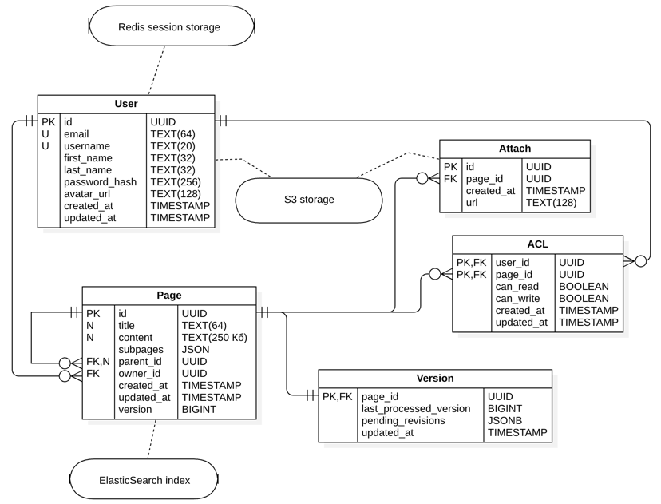
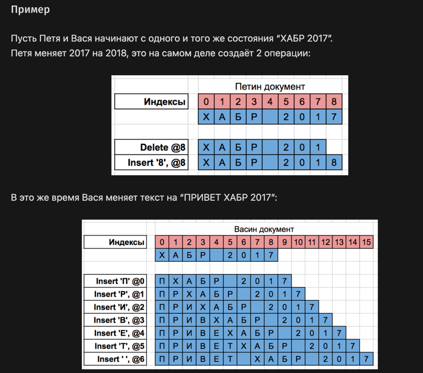

# Notion

## Содержание
[1. Тема и целевая аудитория](#1-тема-и-целевая-аудитория)

[2. Расчет нагрузки](#2-расчет-нагрузки)

[3. Глобальная балансировка нагрузки](#3-глобальная-балансировка-нагрузки)

[4. Локальная балансировка нагрузки](#4-локальная-балансировка-нагрузки)

[5. Логическая схема БД](#5-логическая-схема-бд)

[6. Физическая схема БД](#6-физическая-схема-бд)

[7. Алгоритмы](#7-алгоритмы)

## 1. Тема и целевая аудитория
Notion — сервис для создания заметок и текстовых документов, списков дел, баз данных, таблиц, канбан-досок, баз знаний, ведения проектов и совместной работы.

### Функционал MVP:
- создание и редактирование контента
- совместное редактирование
- управление доступом к контенту
- поддержка разного типа контента (таблицы, списки и прочее)
- прикрепление вложений
- поддержка вложенности контента
- домашняя страница со списком недавних страниц
- поиск своих страниц

### Целевая аудитория
По данным сайта [hypestat](https://hypestat.com/info/notion.so) Notion имеет такие метрики:
- более 5 млн уникальных пользователей в день (DAU)
- более 25 млн уникальных пользователей в месяц (MAU), которые создают более 150 млн заходов на сервис в месяц
- среднее время сессии пользователя - 9 минут
- в среднем пользователь за сессию посещает 9.5 страниц
- bounce rate сервиса - около 27%

### Распределение аудитории

#### По странам:


#### По полу и возрасту:


## 2. Расчет нагрузки
По данным сайта [hypestat](https://hypestat.com/info/notion.so) значение DAU равно 5 млн, MAU - 25 млн.

При расчете нагрузки я буду полагаться на собственный опыт использования Notion и подобных ему сервисах. Концепция такова, что Notion используется средним пользователем как база знаний, в которой пользователь постоянно что-то смотрит/ищет, а иногда что-то дополняет.

### Объем сохраняемых данных

Всего в Notion зарегистрировано около 40 млн пользователей, исходя из чего можно оценить количество сохраняемых данных. Я оценил среднее количество страниц и вложений у пользователя, исходя из своего опыта:

| хранимые данные           | средний размер единицы | ед/пользователь | сколько единиц | суммарный объем  |
|---------------------------|------------------------|:---------------:|----------------|------------------|
| профиль пользователя      | 300 Кб                 |        1        | 40 млн         | 12 Тб            | 
| страницы (без вложений)   | 500 Кб                 |       17        | 680 млн        | 340 Тб           |
| вложения                  | 1 Мб                   |       40        | 1.6 млрд       | 1.6 Пб           |

Суммарный размер хранилищ: 1952 Тб, из которых 1600 Тб - хранилище вложений.

### Запросы пользователей в день и RPS

Данных по количеству действий пользователя в день, кажется, нет в открытом доступе. Можно использовать данные из [hypestat](https://hypestat.com/info/notion.so), согласно которым пользователь посещает 9.5 страниц за сессию, примерно 6 сессий в день. Это 57 страниц в день. Эти 57 страниц будут складываться из 3х аспектов: посещение домашней страницы (на которые пользователь видит список своих страниц и прочие элементы навигации), поиск по страницам, просмотры страниц (кроме домашней).

Предположительные данные по среднему количеству запросов пользователя основаны на моем опыте и представлены в таблице ниже. RPS можно вычислить по формуле: RPS = среднее_кол-во_действий_в_день * DAU / 86400

| Действие                          | Среднее количество в день на пользователя | RPS  |
|-----------------------------------|:-----------------------------------------:|------|
| посещение домашней страницы       |                     13                    | 752  |
| создание страницы                 |                      1                    | 58   |
| поиск страниц                     |                      7                    | 406  |
| регистрация/авторизация           |                    0.1                    | 6    |
| редактирование страницы           |                     12                    | 694  |
| просмотр страницы                 |                     35                    | 2025 |
| прикрепление вложений             |                      3                    | 174  |
| изменение прав доступа к странице |                    0.7                    | 41   |

Получаем средний RPS : 4156. Заложим на пиковый RPS х2.5 от среднего, так как основная часть пользователей географически расположена недалеко друг от друга (в Северной и Южной Америке), а из России Notion ушел. <br/> Получим **пиковую нагрузку в 10390 RPS**.

### Сетевой трафик

С помощью инструментов разработчика в браузере можно посмотреть средник трафик на каждое действие пользователя.

Нагрузку на сеть можно расчитать по формуле: нагрузка[Гбит/c] = средний_трафик_на_действие * RPS * 8 / 1024 / 1024

| Действие                          | Средний трафик на одно действие | Нагрузка на сеть |
|-----------------------------------|---------------------------------|------------------|
| посещение домашней страницы       | 550 Кб                          | 3.16 Гбит/с      |
| создание страницы                 | 110 Кб                          | 0.05 Гбит/c      |
| поиск страниц                     | 370 Кб                          | 1.15 Гбит/с      |
| регистрация/авторизация           | 20 Кб                           | 0.001 Гбит/с     |
| редактирование страницы           | 70 Кб                           | 0.37 Гбит/с      |
| просмотр страницы                 | 490 Кб                          | 7.57 Гбит/с      |
| прикрепление вложений             | 1230 Кб                         | 1.63 Гбит/с      |
| изменение прав доступа к странице | 30 Кб                           | 0.01 Гбит/с      |

Средний трафик на одного пользователя в день: <br/> 13x550 + 1x110 + 7x370 + 0.1x20 + 12x70 + 35x490 + 3x1230 + 0.7x30 = 0.24 Гбит/день

Суммарная нагрузка на сеть: 13.94 Гбит/с <br/> Пусть пиковая нагрузка будет в 2.5 раз больше, чем средняя (также как для RPS). **Получаем пиковую нагрузку: 34.84 Гбит/с**

## 3. Глобальная балансировка нагрузки

### Обоснования расположения ЦОДов

В пункте [1. Тема и целевая аудитория](#1-тема-и-целевая-аудитория) приводилось географическое распределение аудитории Notion. <br/> При размещении ЦОДов также будем учитывать, что пиковая нагрузка может быть до 2.5 раз больше средней, а также заложим ресурсы на будущее развитие.

Также при размещении ЦОДов будем учитывать [распределение населения по плотности](https://www.luminocity3d.org/WorldPopDen/#2/43.7/-3.2) в тех или иных регионах и городах.

Что имеем:

1. 18% аудитории - это США, это почти 1 млн DAU, поэтому в США необходимо расположить несколько ЦОДов в городах с самым большим населением, которые будут распределены по площади:


2. В Южной Корее и Японии находится 10% и 8% аудитории соответственно, что суммарно составляет почти 1 млн DAU. Засчет небольшой площади этих стран, достаточно расположить в них по одному ЦОДу. Также расположим еще один ЦОД в Шанхае, так как в Восточной части Китая сосредоточено достаточно много населения. Также это поможет распределить трафик из Японии и Кореи:


3. В Бразилии находится около 7% аудитории, что составляет 350 тыс DAU. Несмотря на большую площадь страны, для начала достаточно разместить там 1 ЦОД на побережье Антлантики, поскольку всё население сосредоточено именно там, а пользователей в Латинской Америке, скорее всего, будет достаточно мало, и задержка для них будет допустима:


4. Касательно всех остальных стран, точной информации нет, но суммарно на них приходится чуть более 50% аудитории. Предположим, что пользователи примерно равномерно распределены по странам Европы (сосредоточены в столицах и крупных городах), также они есть в России (несмотря на санкции). Будем считать, что на Дальнем Востоке пользователей мало, и для них допустима существенная задержка. Также будем считать, что несмотря на санкции, сервисом будут пользоваться люди из Европейской части России. Получаем примерно такое размещение ЦОДов:


5. Также не будем забывать про пользователей из Южной Азии, Африки и Австралии, для которых есть смысл выделить хотя бы по одному ЦОДу, чтобы они могли адекватно пользоваться сервисом:


Полная карта будет выглядеть так:


Карту можно посмотреть по [ссылке](https://yandex.ru/maps/?um=constructor%3A9e3e864fbf8befc98a37d290e9f00977b6c40c7e8ba41ceb6ec0fb4275b5b2da&source=constructorLink).

### Расчет распределения запросов по ЦОДам

Суммарно имеем 17 ЦОДов на 5 млн DAU.

В идеале каждый ЦОД должен: 
- обслуживать одинаковое среднее количество DAU: 5 000 000 / 17 = 294 000
- получать одинаковое среднее количество RPS: 4156 / 17 = 244.

С учетом того, что по факту на какие-то ЦОДы может ходить в 2 раза больше пользователей из-за их неравномерного распределения, а также с учетом пиковой нагрузки х2.5 от средней, имеем пиковую нагрузку на ЦОД: 244 * 2 * 2.5 = 1220 RPS.

### DNS-балансировка

Для балансировки нагрузки по регионам будем использовать Latency-based DNS. Это означает, что запросы пользователей будут обрабатываться тем ЦОДом, до которого latency минимальна (скорее всего, это будет ближайший географически ЦОД).

### CDN

Для снижения времени загрузки страниц и контента будем использовать CDN: контент может быть кэширован на серверах, распределенных географически, и пользователь будет получать контент с ближайшего.

### BGP Anycast

В каждом из регионов будем использовать BGP Anycast. Это позволит направлять запросы пользователей к ближайшему узлу внутри их региона, что также повысит скорость обработки запросов пользователей.

## 4. Локальная балансировка нагрузки

### Kubernetes

Почему именно k8s:

- автоматически перезапускает упавшие контейнеры, обеспечивая отказоустойчивость;

- берет на себя распределение и перераспределение физических ресурсов, обеспечивая непрерывную работу сервиса;

- является стандартом индустрии.

### Envoy - L7 балансировщик

Для обеспечения L7 балансировки будет использоваться связка Envoy + Envoy Assist.

- Envoy — это высокопроизводительный прокси-сервер, ориентированный на микросервисную архитектуру. Помимо балансировки нагрузки, он поддерживает функции мониторинга и трассировки запросов. Балансировка нагрузки будет осуществляться по правилу least connections.

- Envoy Assist — это расширение для Envoy, которое помогает собирать и обрабатывать метрики, а также управлять конфигурацией. Оно может взаимодействовать с API Kubernetes для получения актуальной информации о состоянии подов и сервисов.

Для чего это нужно:

- **Сбор информации о подах:** Envoy Assist может запрашивать информацию о текущих подах, чтобы получить актуальные IP-адреса и состояния сервисов. Это позволяет Envoy динамически обновлять свою конфигурацию в зависимости от изменений в кластере.

- **Динамическое обновление конфигурации:** Когда новые поды запускаются или старые удаляются, Envoy Assist уведомляет Envoy о необходимости обновления маршрутов и балансировки нагрузки. Это позволяет избежать необходимости вручную настраивать конфигурацию при изменении количества реплик или при сбоях.

Такой подход обеспечивает эффективную и сильно автоматизировнную балансировку нагрузки. 

### Терминация SSL

Обеспечивать безопасность необходимо не только по отношению к запросам извне, но также и во внутренней сети. Поэтому терминация SSL на будет осуществляться на границах каждого микросервиса. Это позволяет контролировать все входящие и исходящие соединения, обеспечивая надежную защиту данных во всем кластере.

## 5. Логическая схема БД



| Таблица | Описание                                                                                                                                                              |
|---------|-----------------------------------------------------------------------------------------------------------------------------------------------------------------------|
| User    | User хранит данные пользователей, такие как email, username, хэш пароля и т.д.                                                                                        |
| Page    | Page хранит данные о страницах, которые создал пользователь.<br/>Хранится название, содержимое страницы, а также данные о связях с другими страницами                 |
| ACL     | ACL хранит данные о том, какой пользователь может видеть или редактировать ту или иную страницу.                                                                      |
| Attach  | Таблица хранит данные о вложениях страницы. Сами вложения будут храниться в S3 хранилище.                                                                             |
| Version | Таблица хранит данные о неприменных версиях страницы, это нужно для синхронизации контента у одновременно редактирующих страницу пользователей. Связана с Page 1-к-1. |

### Ключевые моменты

- Содержимое страниц будет храниться в базе в виде заранее продуманного JSON, либо в виде HTML. Такой подход избавит от проблем с хранением как самого контента, так и с сохранением порядка и местоположения аттачей внутри страницы. Кроме того, это позволит сразу сохранять все примененные стили, а также разный тип контента (списки, таблицы и прочее).
- Для поля content страницы установим ограничение в 250 Кб, соотвественно в это число не входят аттачи. Такой подход, конечно, в некоторой степени ущемляет возможности русскоязычных пользователей, но с другой стороны, для них это ограничение фактически будет означать 125000 символов, что более чем достаточно. Такой подход избавит от проблем с неравномерностью шардирования.
- Для каждого аттача установим максимальный допустимый размер в 2 Мб.
- Для сохранения аттачей будем использовать метож двухфазного коммита: сначала будем создавать запись в таблице Attach с пустым url, затем будем загружать аттач в S3, после успешной загрузки будем проставлят поле url.
- Было решено денормализовать схему данных. Вместо того, чтобы вводить еще одну таблицу со связями между страницами, было решено хранить данные о родительской странице и дочерних страницах в таблице Page.

    В поле subpages будет храниться JSON вида:

    ```json
    [
      {"subpage_1_id": "subpage_1_title"},
      {"subpage_2_id": "subpage_2_title"}
    ]
    ```
    
    Такое решение обосновано тем, что при запросе данных страницы всегда нужно будет запрашивать и данные связанных страниц, чтобы их обобразить, поэтому делать вложенный SELECT или JOIN было бы долго.
    
    Также, в поле parent_id хранится ссылка на родительскую страницу для быстрого перехода.

### Рзамер данных

#### User

- id: 32 байт
- email: 64 байт
- username: 20 байт
- first_name: 32 байт
- last_name: 32 байт
- password_hash: 256 байт
- avatar_id: 32 байт
- created_at: 8 байт
- updated_at: 8 байт

    Итого: 40 млн пользователей по 452 байт --> 18.03 Гб

#### Page

- id: 32 байт
- title: 64 байт
- content: 256000 байт
- subpages: ~(100 байт * 3 дочерних страницы) --> 300 байт
- parent_id: 32 байт
- owner_id: 32 байт
- created_at: 8 байт
- updated_at: 8 байт

    Итого: 680 млн страниц по 66012 байт --> 174.4 Тб

#### Attach

- id: 32 байт
- page_id: 32 байт
- created_at: 8 байт

    Итого: 1.6 млрд аттачей по 72 байт --> 107.29 Гб

#### ACL

- user_id: 32 байт
- page_id: 32 байт
- can_read: 1 байт
- can_write: 1 байт
- created_at: 8 байт
- updated_at: 8 байт

    Итого: ~(680 млн страниц * 5 записей в правах доступа) --> 3.4 млрд записей по 82 байт --> 259.65 Гб

#### Version

- page_id: 32 байт
- last_processed_version: 8 байт
- peding_revisions: ~(35 байт * 50 неприменённых версий) --> 1750 байт
- updated_at: 8 байт

    Итого: 680 млн страниц по 1798 байт --> 1.11 Тб

## 6. Физическая схема БД


### Выбор СУБД

Таблицы User, Page, Attach, ACL будем хранить в `PostgreSQL`, так как у этой СУБД большой функционал, а также есть расширения для масштабирования в кластер и шардирования таблиц, что будет актуально.

Важно отметить, что контент страницы будет храниться также в PostgreSQL в типе JSONB. Этот тип позволяет производить частичные обновления только определенных полей этого json-а, что будет весьма полезно при реализации механизма разрешения конфликтов при совместном редактированиии страниц, так как в таком случае каждый раз перезаписывать полностью страницу просто недопустимо.

Для реализации полнотекстового поиска по страницам пользователя будем использовать `ElasticSearch`, так как он хорошо подходит для данной задачи. Будем хранить в ElasticSearch данные о страницах (Page) пользователей, будем поддерживать консистентность данных. Также ElasticSearch имеет встроенные средства масштабирования, шардинга.

Данные о сессиях пользователей будем хранить в `Redis`, так как у него есть ряд преимуществ:

- большая скорость чтения и записи, за счет хранения в ОП;
- поддерживает master-slave репликацию, что повышает отказоустойчивость;
- достаточно легко масштабируется горизонтально.

### Версионирование страниц

Для реализации алгоритма синзронизации при совместном редактировании была добавлена таблица Version, которая имеет связь 1-к-1 с таблицуй Page. В этой таблице:

- `last_processed_version` - номер последней примененной версии
- `pending_revisions` - имеет тип JSONB - это массив еще не применённых версий, выглядит примерно так:

  ```
  [
    ...,
    {
      "v": 123,       // version
      "o": "insert",  // operation
      "d": "hello",   // data
      "p": 5          // position
    },
    ...
  ]
  ```
  При этом поле `pending_revisions` будет постоянно обновляться: после применения каждой из версий из этого поля, она будет удаляться из json-а (JSONB поддерживает механизм частиного обновления поля).

Также, в таблицу Page было добавлено поле `version`, чтобы знать, какая версия страницы сейчас записана в поле `Page.content`.

По сравнению с таблицей Page, таблица Version будет занимать достаточно мало места. Можно также шардировать ее по page_id, тогда страница и ее версия будут попадать в один шард.

Алгоритм версионирования страниц описан в пункте [7. Алгоритмы](#7-алгоритмы).

### Индексы

#### PostgreSQL:

Построим B-Tree индексы на следующие поля:

- Page.owner_id - так как часто нужно искать страницы, принадлежащие конкретному пользователю
- Attach.page_id - поможет быстрее искать аттачи, входящие в страницу

#### ElasticSearch:

Для реализации полнотекстового поиска по страницам будем строить индекс на основе ngram токенизатора по полям title и content страницы.

### Денормализация

В пункте 5 (логическая схема БД) уже было упоминание о денормализации, продублирую здесь:

Было решено денормализовать схему данных. Вместо того, чтобы вводить еще одну таблицу со связями между страницами, было решено хранить данные о родительской странице и дочерних страницах в таблице Page.

В поле subpages будет храниться JSON вида:

```json
[
  {"subpage_1_id": "subpage_1_title"},
  {"subpage_2_id": "subpage_2_title"}
]
```

Такое решение обосновано тем, что при запросе данных страницы всегда нужно будет запрашивать и данные связанных страниц, чтобы их обобразить, поэтому делать вложенный SELECT или JOIN было бы долго.

Также, в поле parent_id хранится ссылка на родительскую страницу для быстрого перехода.

### Шардирование и репликация

#### PostgreSQL:

Шардировать будем так:

1. Считаем хэш от первичного ключа
2. Определяем, в какой шард попадает этот хэш (например, берем остаток от деления на количество шардов)
3. Читаем/записываем в полученный шард

Такой подход обеспечивает равномерное распределение данных по шардам, что повышает отказоустойчивость. Применим шардирование для таблицы Page, так как она будет очень тяжелой, а также для таблиц Attach и ACL, так как в них будет много записей. При выборе количества шардов будем отталкиваться от максимально возможного размера данных.

Также будем использовать репликацию по схеме master-slave с двумя синхронными slave-ами для таблицы Page. Будем считать, что запрос на запись завершился успешно после того, как получили утвердительный ответ хотя бы от одного slave-а.

#### Redis:

Создадим кластер redis-а, состоящий из 4 инстансов: 2 master-а и 2 slave-а, каждый из который будет являться slave-ом для какого-то одного master-а. Такая схема с шардированием и репликацией помогает снизить нагрузку на каждый из master-ов, а также повышает отказорустойчивость.

Кроме того, будем еще использовать технологию Redis Sentinel:

1. Sentinel постоянно следит за состоянием master-ов и slave-ов. Он проверяет, доступны ли узлы, и собирает информацию о их состоянии.
2. Если Sentinel обнаруживает, что master-узел недоступен, он автоматически назначает один из slave-ов новым master-ом и обновляет конфигурацию.
3. Sentinel может отправлять уведомления о состоянии узлов, что позволяет администраторам быстро реагировать на проблемы.

Такой подход дает еще больше отказоустойчивости, автоматизирует процесс failover и помогает настроить мониторинг за кластером.

#### ElasticSearch:

ElasticSearch также из коробки поддерживет механизмы шардирования и репликации. Поэтому будем разбивать наш поисковый индекс на несколько шардов, которые будут расположены на разных физических узлах. Кроме того, настроим репликацию - по одной реплике на каждый шард. При этом шард и его реплика всегда будут находиться на разных узлах.

Помимо отказоустойчивости и балансировки нагрузки, такой подход позволяет распараллелить поисковые запросы, что значительно ускорит поиск.

### Клиентские библиотеки/интеграции

Backend сервиса будет написан на языке Go. Будут использоваться следующие пакеты для взаимодействия с базами данных:

- для PostgreSQL: [jackc/pgx/v5](https://github.com/jackc/pgx) - высокопроизводительный интерфейс для взаимодействия
- для Redis: [redis/go-redis/v9](https://github.com/redis/go-redis) - официальный интерфейс
- для ElasticSearch: [olivere/elastic/v7](https://github.com/olivere/elastic) - наиболее функциональный и проверенный интерфейс

## 7. Алгоритмы

Поскольку одну и ту же страницу одновременно может редактировать несколько пользователей, необходим некоторый алгоритм разрешения конфликтов и синхронизации страницы между всеми пользователями на ней. Для решения этой задачи подходит алгоритм `OT` - `Operational Transformation`. Схема работы этого алгоритма наглядно описана в [статье на Хабре](https://habr.com/ru/articles/416961/). Вот основные моменты:

1) Все правки документа сводятся к трём различным операциям (operations):
   - вставка текста;
   - удаление текста;
   - применение стилей к тексту.
2) Хранимая иформация:
   * Каждый клиент запоминает следующую информацию:
     - Версия (id, ревизия) последнего изменения, полученного от сервера.
     - Все изменения, сделанные локально, но не отправленные на сервер (ожидающие отправки)
     - Все изменения, сделанные локально, отправленные на сервер, но без подтверждения от сервера.
     - Текущее состояние документа, которое видит пользователь.
   * Сервер, в свою очередь, запоминает:
     - Список всех полученных, но не обработанных изменений (ожидающие обработки).
     - Полная история всех обработанных изменений (revision log).
     - Состояние документа на момент последнего обработанного изменения.

3) Пример работы (из той же статьи на Хабре):




  То есть операции применяются последовательно по журналу, при этом позиция изменения трансформируется в соответствие с текущей версией страницы у пользователя.

Для реализации такого механизма необходимо подумать о двух моментах, которые описаны в пункте [6. Физическая схема БД](#6-физическая-схема-бд):

1) Нужно поддержать возможность частичного обновления страницы при записи примененных изменений - для этого контект страницы хранится в PostgreSQL в типе данных JSONB.
2) Нужно хранить журнал изменений для каждой страницы.
