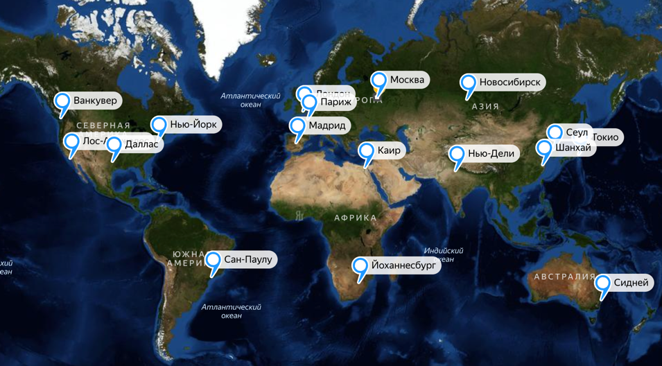

# Notion

## Содержание
[1. Тема и целевая аудитория](#1-тема-и-целевая-аудитория)

[2. Расчет нагрузки](#2-расчет-нагрузки)

[3. Глобальная балансировка нагрузки](#3-глобальная-балансировка-нагрузки)

[4. Локальная балансировка нагрузки](#4-локальная-балансировка-нагрузки)

## 1. Тема и целевая аудитория
Notion — сервис для создания заметок и текстовых документов, списков дел, баз данных, таблиц, канбан-досок, баз знаний, ведения проектов и совместной работы.

### Функционал MVP:
- создание и редактирование контента
- совместное редактирование
- управление доступом к контенту
- поддержка разного типа контента (таблицы, списки и прочее)
- прикрепление вложений
- поддержка вложенности контента
- домашняя страница со списком недавних страниц
- поиск своих страниц

### Целевая аудитория
По данным сайта [hypestat](https://hypestat.com/info/notion.so) Notion имеет такие метрики:
- более 5 млн уникальных пользователей в день (DAU)
- более 25 млн уникальных пользователей в месяц (MAU), которые создают более 150 млн заходов на сервис в месяц
- среднее время сессии пользователя - 9 минут
- в среднем пользователь за сессию посещает 9.5 страниц
- bounce rate сервиса - около 27%

### Распределение аудитории

#### По странам:

#### По полу и возрасту:

## 2. Расчет нагрузки
По данным сайта [hypestat](https://hypestat.com/info/notion.so) значение DAU равно 5 млн, MAU - 25 млн.

При расчете нагрузки я буду полагаться на собственный опыт использования Notion и подобных ему сервисах. Концепция такова, что Notion используется средним пользователем как база знаний, в которой пользователь постоянно что-то смотрит/ищет, а иногда что-то дополняет.

### Объем сохраняемых данных

Всего в Notion зарегистрировано около 40 млн пользователей, исходя из чего можно оценить количество сохраняемых данных. Я оценил среднее количество страниц и вложений у пользователя, исходя из своего опыта:

| хранимые данные           | средний размер единицы | ед/пользователь | сколько единиц | суммарный объем  |
|---------------------------|------------------------|:---------------:|----------------|------------------|
| профиль пользователя      | 300 Кб                 |        1        | 40 млн         | 12 Тб            | 
| страницы (без вложений)   | 500 Кб                 |       17        | 680 млн        | 340 Тб           |
| вложения                  | 1 Мб                   |       40        | 1.6 млрд       | 1.6 Пб           |

Суммарный размер хранилищ: 1952 Тб, из которых 1600 Тб - хранилище вложений.

### Запросы пользователей в день и RPS

Данных по количеству действий пользователя в день, кажется, нет в открытом доступе. Можно использовать данные из [hypestat](https://hypestat.com/info/notion.so), согласно которым пользователь посещает 9.5 страниц за сессию, примерно 6 сессий в день. Это 57 страниц в день. Эти 57 страниц будут складываться из 3х аспектов: посещение домашней страницы (на которые пользователь видит список своих страниц и прочие элементы навигации), поиск по страницам, просмотры страниц (кроме домашней).

Предположительные данные по среднему количеству запросов пользователя основаны на моем опыте и представлены в таблице ниже. RPS можно вычислить по формуле: RPS = среднее_кол-во_действий_в_день * DAU / 86400

| Действие                          | Среднее количество в день на пользователя | RPS  |
|-----------------------------------|:-----------------------------------------:|------|
| посещение домашней страницы       |                     13                    | 752  |
| создание страницы                 |                      1                    | 58   |
| поиск страниц                     |                      7                    | 406  |
| регистрация/авторизация           |                    0.1                    | 6    |
| редактирование страницы           |                     12                    | 694  |
| просмотр страницы                 |                     35                    | 2025 |
| прикрепление вложений             |                      3                    | 174  |
| изменение прав доступа к странице |                    0.7                    | 41   |

Получаем средний RPS : 4156. Заложим на пиковый RPS х2.5 от среднего, так как основная часть пользователей географически расположена недалеко друг от друга (в Северной и Южной Америке), а из России Notion ушел.   Получим **пиковую нагрузку в 10390 RPS**.

### Сетевой трафик

С помощью инструментов разработчика в браузере можно посмотреть средник трафик на каждое действие пользователя.

Нагрузку на сеть можно расчитать по формуле: нагрузка[Гбит/c] = средний_трафик_на_действие * RPS * 8 / 1024 / 1024

| Действие                          | Средний трафик на одно действие | Нагрузка на сеть |
|-----------------------------------|---------------------------------|------------------|
| посещение домашней страницы       | 550 Кб                          | 3.16 Гбит/с      |
| создание страницы                 | 110 Кб                          | 0.05 Гбит/c      |
| поиск страниц                     | 370 Кб                          | 1.15 Гбит/с      |
| регистрация/авторизация           | 20 Кб                           | 0.001 Гбит/с     |
| редактирование страницы           | 70 Кб                           | 0.37 Гбит/с      |
| просмотр страницы                 | 490 Кб                          | 7.57 Гбит/с      |
| прикрепление вложений             | 1230 Кб                         | 1.63 Гбит/с      |
| изменение прав доступа к странице | 30 Кб                           | 0.01 Гбит/с      |

Средний трафик на одного пользователя в день:   13x550 + 1x110 + 7x370 + 0.1x20 + 12x70 + 35x490 + 3x1230 + 0.7x30 = 0.24 Гбит/день

Суммарная нагрузка на сеть: 13.94 Гбит/с   Пусть пиковая нагрузка будет в 2.5 раз больше, чем средняя (также как для RPS). **Получаем пиковую нагрузку: 34.84 Гбит/с**

## 3. Глобальная балансировка нагрузки

### Обоснования расположения ЦОДов

В пункте [1. Тема и целевая аудитория](#1-тема-и-целевая-аудитория) приводилось географическое распределение аудитории Notion.   При размещении ЦОДов также будем учитывать, что пиковая нагрузка может быть до 2.5 раз больше средней, а также заложим ресурсы на будущее развитие.

Также при размещении ЦОДов будем учитывать [распределение населения по плотности](https://www.luminocity3d.org/WorldPopDen/#2/43.7/-3.2) в тех или иных регионах и городах.

Что имеем:

1. 18% аудитории - это США, это почти 1 млн DAU, поэтому в США необходимо расположить несколько ЦОДов в городах с самым большим населением, которые будут распределены по площади:

2. В Южной Корее и Японии находится 10% и 8% аудитории соответственно, что суммарно составляет почти 1 млн DAU. Засчет небольшой площади этих стран, достаточно расположить в них по одному ЦОДу. Также расположим еще один ЦОД в Шанхае, так как в Восточной части Китая сосредоточено достаточно много населения. Также это поможет распределить трафик из Японии и Кореи:

3. В Бразилии находится около 7% аудитории, что составляет 350 тыс DAU. Несмотря на большую площадь страны, для начала достаточно разместить там 1 ЦОД на побережье Антлантики, поскольку всё население сосредоточено именно там, а пользователей в Латинской Америке, скорее всего, будет достаточно мало, и задержка для них будет допустима:

4. Касательно всех остальных стран, точной информации нет, но суммарно на них приходится чуть более 50% аудитории. Предположим, что пользователи примерно равномерно распределены по странам Европы (сосредоточены в столицах и крупных городах), также они есть в России (несмотря на санкции). Будем считать, что на Дальнем Востоке пользователей мало, и для них допустима существенная задержка. Также будем считать, что несмотря на санкции, сервисом будут пользоваться люди из Европейской части России. Получаем примерно такое размещение ЦОДов:

5. Также не будем забывать про пользователей из Южной Азии, Африки и Австралии, для которых есть смысл выделить хотя бы по одному ЦОДу, чтобы они могли адекватно пользоваться сервисом:

Полная карта будет выглядеть так:

Карту можно посмотреть по [ссылке](https://yandex.ru/maps/?um=constructor%3A9e3e864fbf8befc98a37d290e9f00977b6c40c7e8ba41ceb6ec0fb4275b5b2da&source=constructorLink).

### Расчет распределения запросов по ЦОДам

Суммарно имеем 17 ЦОДов на 5 млн DAU.

В идеале каждый ЦОД должен: 
- обслуживать одинаковое среднее количество DAU: 5 000 000 / 17 = 294 000
- получать одинаковое среднее количество RPS: 4156 / 17 = 244.

С учетом того, что по факту на какие-то ЦОДы может ходить в 2 раза больше пользователей из-за их неравномерного распределения, а также с учетом пиковой нагрузки х2.5 от средней, имеем пиковую нагрузку на ЦОД: 244 * 2 * 2.5 = 1220 RPS.

### DNS-балансировка

Для балансировки нагрузки по регионам будем использовать Latency-based DNS. Это означает, что запросы пользователей будут обрабатываться тем ЦОДом, до которого latency минимальна (скорее всего, это будет ближайший географически ЦОД).

### CDN

Для снижения времени загрузки страниц и контента будем использовать CDN: контент может быть кэширован на серверах, распределенных географически, и пользователь будет получать контент с ближайшего.

### BGP Anycast

В каждом из регионов будем использовать BGP Anycast. Это позволит направлять запросы пользователей к ближайшему узлу внутри их региона, что также повысит скорость обработки запросов пользователей.

## Локальная балансировка нагрузки

### Kubernetes

Почему именно k8s:

- автоматически перезапускает упавшие контейнеры, обеспечивая отказоустойчивость;

- берет на себя распределение и перераспределение физических ресурсов, обеспечивая непрерывную работу сервиса;

- является стандартом индустрии.

### Envoy - L7 балансировщик

Envoy будет знать актуальные адреса всех подов сервиса в k8s, он будет направлять запрос на тот или иной под по правилу weighted least connections. Такой подход позволит загрузить сервера пропорционально их ресурсам.

Что ещё может делать Envoy:

- кеширование некоторых запросов;

- трассировка запросов.

### BGP балансировка

В ЦОДах будут находиться маршрутизаторы, которые будут использовать протокол BGP для распределения трафика на L7 балансировщики.
